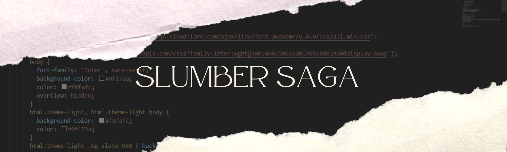
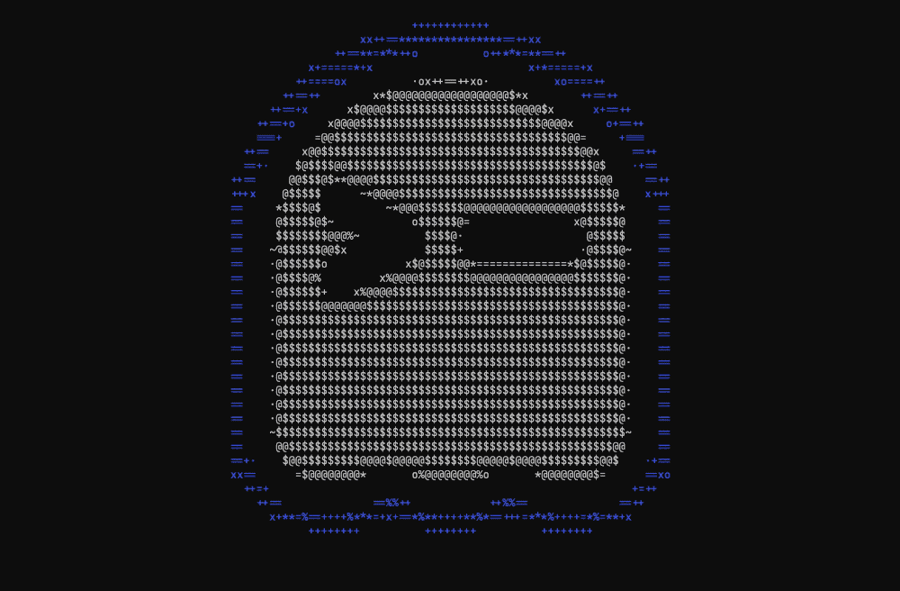

<h1>
  Hey This is Om 
  
</h1>

  <samp>
    About Me
  </samp>

  <samp>
    B.Tech student in AI & ML with hands-on experience building distributed systems, AI-powered automation tools, privacy applications, and full-stack web platforms.Passionate about scalable software engineering, LLM integration, and data security. 
  </samp>

  <samp>
    skills.language
  </samp>

  <samp>
    <a href="https://github.com/search?q=owner%3Aslumbersaga+language%3ATypeScript&type=repositories">TypeScript</a> .
    <a href="https://github.com/search?q=owner%3Aslumbersaga+language%3AJavaScript&type=repositories">Javascript</a> .
    <a href="https://github.com/search?q=owner%3Aslumbersaga+language%3AJava&type=repositories">Java</a> .
    <a href="https://github.com/search?q=owner%3Aslumbersaga+language%3Acpp&type=repositories">C++</a> .
    <a href="https://github.com/search?q=owner%3Aslumbersaga+language%3AC&type=repositories">C</a> .
    <a href="https://github.com/search?q=owner%3Aslumbersaga+language%3AAssembly&type=repositories">Assembly</a> .
    <a href="https://github.com/search?q=owner%3Aslumbersaga+language%3AShell&type=repositories">Bash</a> 
  </samp>

<samp>
  skills.tools
</samp>

  <samp>
    linux .
    photoshop / Premiere Pro 
  </samp>

 

  

  

